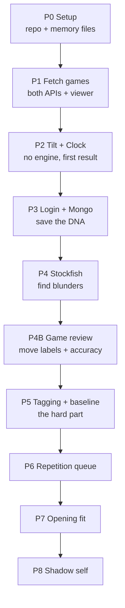

# Chess DNA — Build Plan & Agent Prompts

2026-09-17 · @Someone

## How to use this document

This is the brief you hand to a coding agent, one phase at a time — never the whole thing at once.

The loop for every phase:

1. Copy that phase's prompt from the last section and paste it into the agent.
2. The agent reads the matching feature spec here, then asks you questions before writing any code.
3. You answer. It builds one small slice, shows it, and asks again.
4. When the phase is done it updates `decision.md` and `flow.md`, then stops.
5. You test it yourself. Only then do you paste the next phase prompt.

Two rules for you, not the agent:

- Do not let it run ahead. If it starts Phase 4 work during Phase 2, tell it to stop and re-read the phase scope.
- Do not mark a phase done until you have clicked through it yourself.

Every phase after Phase 0 begins with the agent re-reading `decision.md` and `flow.md`, so it never forgets what was already settled.

## Ground rules for the coding agent

These apply in every phase and override anything else the agent thinks is efficient.

**Ask, don't assume.** Before writing code for a step, state what you are about to build in 2–3 lines and wait for a yes. If something is ambiguous, ask instead of picking. Never batch three questions into one wall — ask one thing, get the answer, move on.

**One slice at a time.** A slice is something the user can see or run. Build it, show it, ask what's next. Never deliver a finished phase in one drop.

**Stay inside the phase.** If an idea belongs to a later phase, write it in `decision.md` under Parked, and do not build it.

**No silent choices.** Any choice a person could reasonably disagree with — a library, a threshold number, a data shape, a route name — goes into `decision.md` with the reason. If the agent picks something because the user was unavailable, it must say so and flag it for review.

**No fake work.** No mock data unless the user asks for it. No placeholder functions that return fixed values pretending to be real. If something can't be built yet, say it can't.

**Free tier only.** Nothing in this project may require a paid service, a credit card, or a paid API key. If a step seems to need one, stop and ask.

**Small files.** Split logic into small modules with clear names. The user will read this code, and they are not a heavy-jargon person — plain naming, short functions, comments where the chess logic is non-obvious.

**Phase exit.** A phase ends only when: it works in the browser, `decision.md` and `flow.md` are updated, and the user has said done.

## The two living files

Both sit at the repo root. The agent creates them in Phase 0 and updates them at the end of every phase — and immediately whenever a real decision is made mid-phase.

### decision.md — why things are the way they are

Newest entry at the top. One entry per decision, never edited later; if a decision is reversed, add a new entry that says so and links back.

```
## D-014 — Blunder threshold set at 150 centipawns
Date: 2026-09-20
Phase: 4
Decided by: user

What: A move counts as a mistake if the engine eval drops 150cp or more.
Why: 100cp flagged too much noise in 1200-rated games; 200cp missed real errors.
Alternatives considered: dynamic threshold by rating (parked, too complex for now).
Affects: analysis/detectBlunders.js, the DNA summary counts.
```

Rules for the agent:

- `Decided by` is `user` or `agent`. If `agent`, add a line `Needs review: yes`.
- Every magic number in the code must trace to an entry here.
- A section at the bottom called **Parked** holds ideas raised too early, with the phase they belong to.

### flow.md — what the app actually does now

This one is rewritten, not appended. It always describes the current state, never history.

It holds four things:

1. **User journey** — every screen in order, what the user sees, what they click, where it leads.
2. **Data flow** — where data enters, what transforms it, where it is stored, in a Mermaid diagram.
3. **File map** — a table of each important file and what it is responsible for.
4. **Built / not built** — a checklist of the features in this doc, with phase numbers.

When a phase changes the journey, the agent rewrites the affected part and shows you the diff before committing.

## What we are building

A web app that reads your online chess games and tells you how *you specifically* lose — then trains that away.

Every other tool analyses one game at a time and tells you what the engine thinks. This one looks across hundreds of your games and finds the patterns you repeat, then compares them against other players at your rating so it only reports things that are actually unusual about you.

**The Chess DNA** is the one object everything revolves around. It is a single profile per user that holds:

- The tactical motifs you miss more often than your rating peers
- How many games into a session your play starts falling apart
- Where you burn clock and where you rush
- Which position types you win in and which you drown in
- A queue of your own past blunders, scheduled for re-testing

Every feature reads from the DNA and writes back to it. The DNA gets sharper the more you play. That accumulated profile is the product — the features are just ways of viewing it and acting on it. A competitor can copy any single feature in a weekend; they cannot copy a user's two-year-old DNA.

**One design rule above all others:** the app must say few things, bluntly. Three sharp findings beat twenty charts. If a finding cannot be stated in one sentence a 1200-rated player understands, it does not ship.

## The evidence rule

This applies to every feature in this document, without exception.

**No finding is ever shown without a way to see the games it came from.** A number the user cannot verify is a number they will not believe. Every statement the app makes must be one tap away from the actual positions behind it.

What that means in practice:

1. **Every finding is clickable.** "You miss backward knight moves, 31 times" opens a list of those 31 moments. Never a dead statistic.
2. **Each moment shows a real board**, not a description. Set up the position exactly as it was, right before the mistake.
3. **Mark the board itself:**
   - Red arrow — the move that was played
   - Green arrow — the move the engine wanted
   - Highlighted square — the piece that hung, the mating square, whatever the tag points at
   - If the refutation is a short sequence, let the user step through it one move at a time
4. **Say what happened next in one line.** "You lost the knight on move 24 and the game on move 31."
5. **Always link back to the original game** on Chess.com or Lichess. The user must be able to check you.
6. **Thumbnails in lists.** A list of 31 moments shows 31 small boards, not 31 rows of text. Pattern recognition is visual; a chess player will spot the repeat themselves before reading a word.
7. **Group by similarity where possible.** If 12 of the 31 are the same structure, say so and show that group first. That is the moment the lesson lands.

The same rule binds the tilt and clock features: a claim about session three links to those actual third games; a claim about wasted time on move 6 links to the games where it happened.

If a feature cannot show its evidence, the feature is not finished.

## Feature specs

### Feature 1 — Blind-spot finder

**What the user sees:** "You miss backward knight moves. 31 times in 200 games — about 3x the rate of other 1400s."

**Why it's different:** every tool says "you are weak in endgames". That is true of everyone. This one only reports things where the user is measurably worse than their own rating peers.

**How it works, step by step:**

1. **Find the mistake moments.** Run each game through Stockfish. A move is flagged when the eval swings against the player by 150cp or more. Skip positions already decided — if the eval before the move is worse than -600 or better than +600, ignore it. Skip book moves (first 6–8 moves, or matched against a small opening file).
2. **Capture the moment.** Store the FEN before the move, the move played, the engine's best move, the eval before and after, the move number, and the clock reading.
3. **Tag it.** This is the hard, valuable part — see the tagging list below.
4. **Compare to baseline.** Load a static JSON of average tag rates per rating band (generated once offline). Report only tags where the user's rate is meaningfully above baseline and the sample is big enough — minimum 8 occurrences, or don't show it at all.
5. **Rank and cut.** Show the top 3 findings only. The rest go behind a "more" link.

**The tag list.** Each flagged position gets zero or more of these. All are computed with plain board logic using chess.js — no machine learning anywhere in this feature.

| Tag | How to detect it |
| --- | --- |
| Hanging piece | After the played move, a piece of the player is attacked and undefended, and the engine's best line wins it |
| Missed fork | Engine's best move for the opponent attacks two or more valuable pieces at once |
| Back rank | Best line delivers mate or wins material on the player's first rank while their king has no pawn escape |
| Pin missed | A piece the player moved was pinned, or the best move creates a pin the player ignored |
| Discovered attack | Opponent's best move moves one piece and opens a line from another |
| Backward move missed | The engine's best move goes toward the player's own side of the board — this is the classic human blind spot |
| Quiet move missed | The best move is not a capture, check, or threat; humans almost never find these |
| Trade blunder | The mistake was a capture or recapture that loses material after the full sequence |
| King safety | Eval drop happens while the player's king has fewer than two defenders nearby |
| Pawn break missed | The best move was a pawn push that opens the position |

**Where it writes to DNA:** `dna.blindSpots` — array of `{tag, count, gamesAnalysed, userRate, baselineRate, ratio}`.

**Explicitly not in scope:** explaining the position in prose, video lessons, engine lines longer than the immediate refutation.

### Feature 2 — Tilt detector

**What the user sees:** "Your 3rd game in a session is played like a 1240, not a 1420. After a loss, you lose the next one 71% of the time. Stop after two."

**Why it's different:** every tool analyses one game in isolation. Nobody looks at a *sitting*. For online players this is the single biggest rating leak and it needs no engine at all.

**How it works:**

1. **Cut games into sessions.** Sort by end time. A gap of more than 30 minutes starts a new session. Ignore sessions of one game.
2. **Index each game inside its session.** Game 1, game 2, game 3, and so on.
3. **Measure quality per game.** Two ways, both cheap:
   - Result-based: win rate and score by session index.
   - Blunder-based: blunders per game by session index — only available once Phase 4 exists, so build result-based first.
4. **Find the break point.** The session index where score drops meaningfully and stays down. Needs at least 20 sessions of data to say anything; below that, show "not enough games yet" instead of a fake number.
5. **Check the tilt chain.** Score in the game immediately after a loss, versus overall score. Also after a loss on time, and after a loss from a winning position — these hurt more, and it's worth separating them.
6. **Time-of-day check.** Score by hour of day, in the user's timezone. Many people have a clear bad hour.

**The output must be one instruction, not a chart.** "Stop after 2 games" or "Never play after midnight — you score 38% there." Charts are supporting evidence below the line, not the headline.

**Where it writes to DNA:** `dna.tilt` — `{stopAfterGames, postLossScore, overallScore, worstHour, sessionsAnalysed}`.

**Explicitly not in scope:** blocking the user from playing, browser extensions, notifications.

### Feature 3 — Clock fingerprint

**What the user sees:** "You spend 2 minutes on move 8 in positions you've played 40 times. Then you have 45 seconds left when the game is actually decided, and that's where 60% of your blunders happen."

**Why it's different:** every site shows time-per-move as a bar chart and leaves you to figure it out. Nobody names the *pattern* or tells you what to change.

**How it works:**

1. **Read the clocks.** Both Chess.com and Lichess put clock readings in PGN comments like `{[%clk 0:02:31]}`. Time spent on a move is the difference between consecutive readings for that player, plus increment.
2. **Split the game into three zones** by move number and material: opening (to move 12), middlegame, endgame. Also mark the last 20% of clock time as the scramble zone.
3. **Compute the four numbers that matter:**
   - Time spent in the opening as a share of total — high means thinking about known positions.
   - Longest single think, and whether the move played after it was actually good. Long thinks that still produce a mistake are a strong signal.
   - Share of blunders that happen under 60 seconds (needs Phase 4).
   - Games lost on time, and how many of those were winning or equal.
4. **Cross-check against the opening book.** If the user has played this exact position 20+ times before and still spent 90 seconds, that is pure waste and worth calling out by name: "You spend 90 seconds on move 6 of the London. You've played it 47 times."

**Where it writes to DNA:** `dna.clock` — `{openingTimeShare, avgLongestThink, scrambleBlunderShare, flaggedLosses, wastefulPositions[]}`.

**Explicitly not in scope:** live coaching during a game, recommending a different time control (that can come later).

### Feature 4 — Reverse opening advice

**What the user sees:** "You score 61% in closed positions and 38% in open ones. You currently play the Italian, which opens the game immediately. The French and the Caro give you the structures you actually handle."

**Why it's different:** every opening tool recommends what the engine likes or what is trendy. This one ignores opening names at first and looks only at the *kind of position* the user performs well in, then works backwards to openings that produce it.

**How it works:**

1. **Classify every position at move 15** (or the last move if the game ended earlier) into a structure type. Use plain pawn logic, no ML:
   - Open — 4 or fewer pawns on the board's central files, both bishops have long diagonals
   - Closed — locked pawn chains, 3+ blocked pawn pairs
   - Semi-open — one side has a half-open file
   - IQP — one side has an isolated d-pawn
   - Opposite castling — kings on opposite wings
   - King's Indian type, Carlsbad type, and so on, added only if easy to detect
2. **Score each type.** Win/draw/loss and average blunder count per type, for this user. Needs at least 15 games in a type before reporting it.
3. **Compare to the user's actual repertoire.** Map their current openings to the types those openings usually produce, using a small static table you write once.
4. **Recommend.** Suggest openings whose typical structure matches the user's strong types, and warn about the ones in their repertoire that lead to weak types. Always show the numbers behind the advice.

**Important honesty rule:** this feature must never present a recommendation without its sample size. "38% in 22 open games" is fine; "you're bad at open positions" with no number is not.

**Where it writes to DNA:** `dna.structures` — array of `{type, games, score, blundersPerGame}` plus `dna.repertoire`.

**Explicitly not in scope:** opening theory lines, move-by-move repertoire trees, Chessable-style drilling.

### Feature 5 — Mistake repetition

**What the user sees:** a daily queue. "You have 6 positions due." Each one is a board from their own game, right before they went wrong, with a prompt: find the best move.

**Why it's different:** puzzle sites give you positions a computer thinks are instructive. This gives you the exact position where *you* failed, and it keeps coming back until you stop failing it.

**How it works:**

1. **Queue is seeded from Feature 1.** Every flagged blunder position becomes a candidate card. Store FEN, correct move(s), the move actually played, the tag, and the source game link.
2. **De-duplicate.** Two nearly identical positions from different games should not both be cards. Compare piece placement; if 90% of pieces match and the tag is the same, keep one and note the repeat count — a position you blundered three times is more valuable, not three cards.
3. **Scheduling — simple SM-2 style:**
   - New card due immediately
   - Solved correctly → next due in 3 days, then 10, then 30, then 90
   - Failed → back to the front of the queue, interval resets to 1 day
   - A card retired after 3 clean solves; it stays in history
4. **Grading the answer.** The card is solved if the user plays the engine's best move, or any move within 30cp of it. Multiple good moves must be accepted — this is important, a strict single-answer check will feel broken and unfair.
5. **Show the context after, not before.** Once solved or failed, reveal: what you played in the real game, what happened next, and a link to that game. This is the moment the lesson lands.
6. **Cap the daily queue at 10 cards.** Long queues get abandoned.

**Where it writes to DNA:** `dna.queue` — array of `{fen, bestMoves[], playedMove, tag, dueDate, interval, streak, sourceGameUrl, repeatCount}`.

**Explicitly not in scope:** a puzzle rating system, leaderboards, streaks-as-pressure, notifications.

### Feature 6 — Shadow self

**What the user sees:** a bot that plays like them, blunders included. Playing against your own bad habits from the other side is uncomfortable and extremely memorable.

**Why it's last:** it is the most impressive feature and the most likely to eat three weeks and produce something unconvincing. Do not start it until Features 1–5 are live and people are using them.

**The cheap version — build this first.** No training, no ML:

1. Run Stockfish at a deliberately weak setting (low depth, or Stockfish's Skill Level around the user's rating band).
2. Inject the user's own blind spots as behaviour rules. If their DNA says they miss backward moves, make the bot exclude backward moves from consideration a set percentage of the time. If they hang pieces under time pressure, make the bot play faster and worse as its clock drops.
3. When the bot makes one of these characteristic mistakes, tell the user afterwards: "That was your back-rank blind spot. You've done that 31 times."

This is a rules engine dressed as a personality, and honestly it will feel more like the user than a weak neural net would, because it fails in *their* specific ways instead of failing randomly.

**The expensive version — only if the cheap one proves people want it.** Fine-tune a Maia-style model on the user's games. This needs real compute and probably money. Park it.

**Where it reads from DNA:** everything. This feature is a consumer of the profile, not a producer.

**Explicitly not in scope for v1:** rated games against the shadow, sharing your bot with others, a bot marketplace.

### Feature 7 — Game review

**What the user sees:** open any of their games, step through it on a board, every move labelled — Brilliant, Great, Best, Excellent, Good, Book, Inaccuracy, Mistake, Miss, Blunder — with an accuracy percentage for both sides and a plain-English note on the bad ones.

**Be honest about this one:** it is the only feature here that is not unique. Lichess gives it away free. It earns its place for two other reasons: it is the screen people open every day, and it is where a DNA finding stops being a statistic and becomes "this is the 12th time you have done this." Build it, but never sell the product on it.

**The critical rule: classify on win percentage, not centipawns.** Losing 300cp while already a queen up means nothing; losing 300cp from an equal position loses the game. Convert every eval to an expected score first, then measure how much of it the move threw away. Lichess publishes the conversion formula and it is a single line of maths. Every threshold below is a win-percentage drop, never a centipawn drop.

**This forces two analysis modes.** They are different jobs and must not share settings:

| Mode | Depth | Lines | When it runs | Purpose |
| --- | --- | --- | --- | --- |
| Bulk scan | 12–14 | 1 | All games, on sync | Feeds the DNA — needs to be fast |
| Deep review | 18 | 3 (MultiPV) | One game, on demand | Feeds this feature — needs the runner-up moves |

MultiPV is required because "Great" and "Brilliant" both depend on knowing how much worse the *second*-best move was. Running MultiPV across 50 games would take far too long, which is why the two modes exist.

**The label rules:**

| Label | Condition |
| --- | --- |
| Book | Position still matches the opening file |
| Brilliant | Meets Great, and the player gave up material worth 3 or more points net, and the position is still equal or better afterwards |
| Great | The best move is 10% or more win-percentage better than the second-best, and the player found it |
| Best | Matches the engine's top move |
| Excellent | Win-percentage loss under 2 |
| Good | Win-percentage loss under 5 |
| Inaccuracy | 5 to 10 |
| Mistake | 10 to 20 |
| Miss | A forced mate or a clearly winning tactic was available and the player played something else |
| Blunder | Over 20 |

Check labels in this order and stop at the first match. Every one of these numbers goes in `decision.md` and gets tuned against real games — do not treat them as final.

**Brilliant is the label that will embarrass you.** Every user knows what one feels like, and a wrong one destroys trust in the whole app. Keep it strict, and when unsure, downgrade to Great.

**Accuracy score.** Average the win-percentage loss across all of a player's moves in the game, then map it to a 0–100 figure. Show it for both sides. Do not invent a rating estimate from it in v1.

**The suggestions are free.** The motif tags from Feature 1 are already computed. Turn each into a template sentence: "This hangs the knight on f6 — you have lost a piece this way 14 times." No AI model, so no cost, and it ties the review back to the DNA on every screen.

**Caching.** A deep review takes 20–40 seconds. Store the finished review in IndexedDB so re-opening the same game is instant. It does not go to Mongo — reviews are re-derivable and would blow the free tier.

**Where it writes to DNA:** nothing new. It consumes Phase 4 output and feeds the Feature 5 queue.

**Explicitly not in scope:** an AI coach voice, generated commentary, video, opening theory explanations, a rating estimate.

## Tech stack

These are locked. The agent may not swap any of them without asking and writing a `decision.md` entry.

| Layer | Choice | Why |
| --- | --- | --- |
| Frontend | React + Vite | Plain React, no framework wrapped around it |
| Hosting | Vercel free tier | Serves the React build and the small API from one repo, no card needed |
| Backend | 3–4 serverless functions in an `/api` folder | React runs in the browser, so it can never hold the Mongo password — these tiny files do the database talking |
| Login | Google Identity Services button + `google-auth-library` | Free, no auth vendor; the function verifies the Google token |
| Session | Signed JWT in an httpOnly cookie | No session store, nothing extra to run |
| Database | MongoDB Atlas free tier (512MB) | The DNA is nested and changes shape per user — Mongo stores that as-is |
| Engine | Stockfish WASM, single-thread build | Runs in the user's browser, so analysis costs us nothing |
| Chess logic | chess.js | Legal moves, FEN, PGN parsing, attack detection for the tag rules |
| Board UI | react-chessboard | Free, well maintained, handles drag-and-drop |
| Routing | react-router | Plain client-side routes |
| Game data | Chess.com public API + Lichess API | Both free, no keys needed |
| Baseline data | Static JSON in `/public` | Built once offline on your own laptop |

**Why there is still a backend.** Everything except the database can run in the browser. But if React held the Mongo connection string, anyone could open dev tools and read your whole database. So four small functions sit in `/api`: sign in, load DNA, save DNA, save queue. They are a few dozen lines each and Vercel runs them free. Phases 0 to 2 need none of them — you build them in Phase 3.

**Fetching games happens straight from the browser.** Both chess APIs allow it, so those calls need no backend at all.

**The one thing to watch:** Stockfish WASM must run inside a Web Worker, not on the main thread, or the browser tab will freeze during analysis. This is the most common way this build goes wrong.

**Also:** the single-thread WASM build avoids needing special cross-origin headers. The multi-thread build is faster but requires `COOP`/`COEP` headers that fight with other things. Start single-thread; revisit only if speed becomes a real problem.

**Offline prep tools** (run on the user's laptop, never in production): Python with `python-chess` to process Lichess dumps into the baseline JSON.

## Design direction

The app must not look like it was generated. The agent reads this section before building any screen.

**The trap.** Frosted cards floating on a purple-to-blue gradient is the default look every AI model produces. Using glassmorphism the obvious way produces exactly the generated appearance we are trying to avoid.

**Use glass only where it is physically justified.** Glass needs something real behind it to blur:

- A panel floating over the chess board — justified
- A sticky header over a scrolling list of games — justified
- An overlay on top of a position while stepping through a line — justified
- A card sitting on a flat background — not justified; that is just a grey box with a border, and it is the version that looks generated

**Density over air.** Chess players are used to dense interfaces — Lichess is dense, and its users like it that way. Large padding, big rounded cards and lots of whitespace will feel wrong to this audience no matter how polished it looks.

**Specific things to avoid:**

- Purple or indigo gradients anywhere
- Gradient text on headings
- A centred hero section with a big tagline
- Emoji used as interface icons
- Everything rounded to the same large radius
- Three equal feature cards in a row

**What to do instead:**

- Dark interface by default. The board is the brightest thing on screen and everything else recedes.
- Draw the palette from the board itself — wood, slate, bone — with exactly one accent colour for findings and warnings. Not two.
- Give headings a typeface with real character; keep body text and all numbers in something plain, and use tabular figures so statistics line up in columns.
- Let the board be the visual anchor of every screen. It is the only illustration this app needs.
- Motion only where it explains something — a piece sliding to show the move that should have been played. Never decorative animation.

**The test:** if a screenshot could belong to any AI-built SaaS product, it has failed. It should be recognisable as a chess tool within one second.

## Data model

**The rule that keeps you inside 512MB: never store games.** Games live on Chess.com and Lichess. Fetch them, analyse them in the browser, keep only the conclusions.

Three collections:

**`users`** — email, name, chessComUsername, lichessUsername, rating, createdAt, lastSyncAt, lastAnalysedGameId per platform. About 300 bytes.

**`dna`** — one document per user, holding `blindSpots`, `tilt`, `clock`, `structures`, `repertoire`, plus `gamesAnalysed` and `updatedAt`. About 3–5KB.

**`queue`** — one document per user holding the repetition cards. Each card is roughly 200 bytes; cap at 200 cards per user by dropping the oldest retired ones. About 40KB worst case.

So a heavy user costs around 45KB. The free tier holds roughly 10,000 users. That is far more than this project will have before it makes money.

**In the browser, not the database:**

- Raw PGNs of the current sync — held in memory, discarded after analysis
- Analysis progress — IndexedDB, so a refresh mid-analysis doesn't lose work
- Guest results before signup — IndexedDB, uploaded to Mongo when they create an account

**Sync strategy:** on each visit, fetch only games newer than `lastAnalysedGameId`. First run analyses 50 games; later runs usually analyse 5–20 and finish in seconds.

**Baseline JSON:** shipped as a static file in the repo, around 50–100KB. Structure: `{ratingBand: {tag: rate}}` in bands of 200 points from 800 to 2200.

## The phase plan

Nine phases. Each one ends with something you can click.



### Phase 0 — Setup

React + Vite project, folder structure, `decision.md` and `flow.md` created with their first entries, deployed to Vercel so a blank page is live. **Done when:** a real URL loads and both files exist. No features.

### Phase 1 — Fetch games

Enter a username, pick platform, pull games, normalise both platforms into one internal shape. Show a plain list: date, opponent, result, time control. Then build a basic game viewer — click any game to open a board with a move list beside it, step forward and back through the moves, flip the board. No engine, no evaluation, no labels; that comes later. This exists now so every later phase has somewhere to link a finding into, which the evidence rule requires. It is also the first screen built to the design direction, so get the board and the palette right here — everything else inherits from it. **Done when:** you can type your own username, see your real games, and click one open to replay it move by move. **Watch for:** Chess.com serves games by month archive; Lichess streams NDJSON. Handle a username that doesn't exist.

### Phase 2 — Tilt + Clock

Both Feature 2 and Feature 3 in full, since neither needs an engine. This is your first real product moment. **Done when:** the app tells you something true about yourself you didn't know. **Ship this to 5 chess friends before Phase 3.**

### Phase 3 — Login and saving

Google login, Mongo, guest-to-account migration, usernames saved so they're never asked again. **Done when:** you close the tab, come back tomorrow, and your DNA is still there.

### Phase 4 — Stockfish

WASM engine in a Web Worker, eval every position, flag blunder moments, show them on a board. Progress bar that doesn't freeze the tab. **Done when:** 50 games analyse in under 3 minutes and you can click through the blunders. **This phase is mostly plumbing — expect it to be fiddly.**

### Phase 4B — Game review

Feature 7 in full: the second analysis mode with MultiPV 3, a board you can step through, move labels, accuracy for both sides, plain-English notes from the Feature 1 tags, and IndexedDB caching. **Done when:** you open one of your own games and the labels broadly agree with what Chess.com says about that same game. **Watch for:** check against at least four real games before trusting the thresholds, and tune the numbers in `decision.md`, never quietly in the code. **Keep Brilliant strict** — a wrong one costs more trust than ten missed ones.

### Phase 5 — Tagging and baseline

The tag rules from Feature 1, plus the offline baseline job, plus the comparison. **Done when:** the app says "3x your rating peers" about something real. **This is the hardest phase — do the tags one at a time, starting with hanging piece and back rank.**

### Phase 6 — Repetition queue

Feature 5 end to end: cards, scheduling, solving, reveal. **Done when:** you come back three days later and the right cards are waiting.

### Phase 7 — Opening fit

Feature 4: structure classification, scoring, recommendations. **Done when:** it tells you to drop an opening and shows the numbers.

### Phase 8 — Shadow self

The cheap rules-based version only. **Done when:** you play it and recognise yourself.

## Copy-paste prompts

There are only three prompts below. You reuse two of them over and over.

**Paste order, start to finish:**

1. **Standing prompt** — once, at the very beginning of the chat with the agent. Never again.
2. **Phase prompt** — immediately after it, filled in for Phase 0. Then the agent starts asking questions.
3. **Closing prompt** — when Phase 0 looks done to you.
4. **Phase prompt** again, filled in for Phase 1. Then closing prompt. Then Phase 2. And so on, alternating, through Phase 8.

**If you start a fresh chat** (context gets full, or you come back next week), paste the standing prompt again, then: `Read decision.md and flow.md, tell me what's built and what phase we're on, then wait.` Do not re-paste old phase prompts.

One phase, one filled-in prompt, one closing prompt. That's the whole rhythm.

### The standing prompt — paste this once, at the very start

```
We are building a chess analysis web app together, over multiple phases.
I will give you one phase at a time. You must never work ahead of the
phase I have given you.

Rules you follow for the entire project:

1. Before writing code for any step, tell me in 2-3 lines what you are
   about to build, and WAIT for me to say yes.
2. Ask me one question at a time. Never send me a list of five questions.
3. Build in small slices. After each slice, show me what it does and ask
   what's next. Never dump a finished phase on me.
4. If something is ambiguous, ASK. Do not decide for me.
5. Keep two files at the repo root, always up to date:
   - decision.md : every decision, why we made it, what it affects.
     Newest at top. Never edit old entries; add new ones that supersede.
     Mark whether I decided it or you did.
   - flow.md : what the app currently does. User journey screen by screen,
     a mermaid diagram of the data flow, a file map table, and a
     built/not-built checklist. Rewrite it, don't append.
   Update both at the end of every phase, and immediately whenever a real
   decision gets made.
6. Every magic number in the code must have a decision.md entry.
7. Nothing in this project may cost money. No paid APIs, no paid hosting,
   no credit card. If a step seems to need one, STOP and ask me.
8. Write plain, simple code with clear names. I will be reading it and I
   am not comfortable with heavy jargon. Explain chess logic in comments.
9. An idea that belongs to a later phase goes into decision.md under
   "Parked". Do not build it.

10. Two global rules apply in every phase. Read both before building any
    screen: every finding must be clickable down to the real board position
    it came from, and the UI follows the "Design direction" section.

Before we start: read the phase brief I paste next, then ask me your
first question. Do not write any code in your first reply.
```

### Each phase prompt

For every phase, paste this, filling in the two blanks from the sections above:

```
PHASE <n>: <phase name>

First, read decision.md and flow.md so you know where we are.

Scope of this phase — build ONLY this:
<paste the phase paragraph from "The phase plan">

The feature spec you are implementing:
<paste the matching feature spec section, in full>

Definition of done:
<paste the "Done when" line>

Out of scope for this phase: everything else in the project, including
the "Explicitly not in scope" items in the spec above.

Start by asking me your first question. No code yet.
```

### At the end of each phase

```
Phase <n> looks done to me. Before we close it:

1. Update decision.md with every decision from this phase, including
   the ones you made yourself. Mark those "Needs review: yes".
2. Rewrite the changed parts of flow.md and show me the diff.
3. List anything you parked, and which phase it belongs to.
4. Tell me honestly: what is fragile in what we just built, and what
   will break first when real users touch it?

Then stop. Do not start the next phase.
```

That last question is the most useful one in this document. Ask it every single time.
