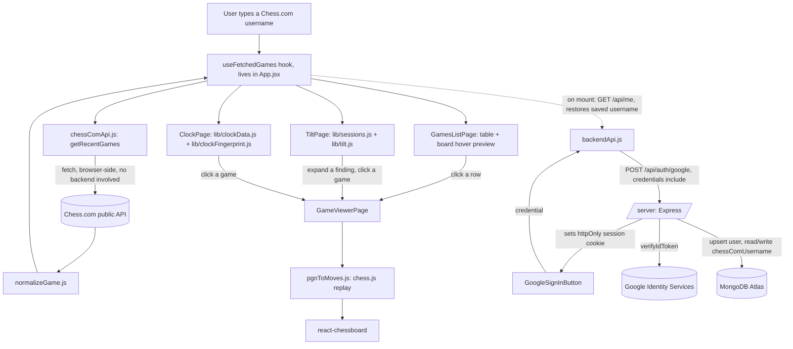

# flow.md — what the app actually does now

This file describes the current state only. It is rewritten each phase, not appended to. See
`decision.md` for the reasoning behind any of this, and `rnd.md` for open questions still being
researched.

## 1. User journey

**The frame (D-051).** On a laptop, a frosted-glass icon rail on the left: Games, Tilt, Clock,
Blunders, with the current screen lit in gold, and your account at the bottom (Google's round
sign-in button, or your initial, which opens a menu with Sign out). On a phone, a slim top bar
(logo + account) and a **tab bar along the bottom**, within thumb reach. You always see where you
are. Every screen fades and rises in; lists cascade. The browser's own **back button / phone back
gesture** works throughout — back from a game returns to the screen you opened it from, instead of
leaving the site. Nothing relies on hover on a touch screen. Before any games are loaded, Tilt,
Clock and Blunders each show a short "fetch your games first" card with a button to the Games screen.

1. **Onboarding (first-time visitors only)** — "Find out how you *specifically* lose." beside a board
   quietly playing through an opening. A glass card offers "Sign in with Google" (saves your username
   for good) or a username field and "Continue as guest" (asked again next visit). Signed in but no
   saved username yet: just the username step, greeting you by name. With a saved username you
   never see this screen again — you land in the app with your games already loading.
2. **Games** — the headline, then a glass card: Chess.com username, a gold slider for how many games
   (1-100, step 1), and a gold "Fetch games" button (placeholder rows shimmer while loading). Under
   it, the **time-control filter** (All / Bullet / Blitz / Rapid / Daily, each with a count, a gold
   pill sliding under the chosen one) — shared by every screen, so switching to Bullet re-runs every
   analysis on just your bullet games. Then three stat cards from the games on screen: your record
   (W–L–D), your score %, and your rating in the time control you play most, with its change and a
   sparkline. Then the games: on a laptop, a table (result pill, opponent + rating, your colour, time
   control, date) with a "how it ended" board beside it that shows a game's final position when you
   hover its row; on a phone, one card per game (a W/L/D badge, opponent + rating, time control,
   date) and no hover board, since there's nothing to hover with. Tap or click a game to open it.
3. **Game viewer** — a header with back, "vs Opponent" + their rating, the date and time control, a
   result pill, and a link to the game on Chess.com. The board (opponent's strip and clock above, yours
   below, whoever is to move lit; the evaluation bar beside it, or under it on a phone). The **review
   starts by itself**: every move gets a label (Brilliant … Blunder), labels arrive one by one, and a
   reviewed game reopens instantly from the browser's cache. The current move's verdict reads as a
   sentence with the label word emphasised in its colour ("O-O-O **is good** · best was **a3**"), with
   the same medal drawn on the board on the square the piece landed on, both of the move's squares lit,
   and a green arrow to the better move when there was one. Accuracy for both players is the headline
   number once the review finishes. **Laptop:** a glass panel beside the board — status/accuracy, the
   verdict, then **Moves / Review** tabs (Moves: one row per move number with verdict glyphs and
   thinking times; Review: the scorecard of every label for both players, plus the per-game rating
   estimate), with the controls at the bottom and **←/→/Home/End** on the keyboard (F flips). **Phone:**
   a sticky slim header, a full-width board, a sideways moves strip that keeps the current move
   centred, the verdict, then accuracy and the scorecard; the five controls (first, back, **next** in
   gold, last, flip) are pinned to the bottom of the screen. Stepping through moves never scrolls the
   page — only the moves list moves. Drag any piece to explore your own line; one tap returns to the
   game. Opened from a finding, the viewer arrives on the exact move, with the reason as a gold callout.
4. **Tilt** — the headline IS the finding: "Stop after **8 games** in a sitting" (or "No clear break
   point yet"). Score by game-in-session as **bars**, the break point in gold; tap a bar for the games
   behind it. Cards for "after a loss" (overall vs. next game after a loss vs. after losing on time)
   and time of day (worst hour and your score then), each with a toggle listing its real games. Below
   20 sessions: "Not enough sessions yet", a meter showing how close you are (e.g. 8 / 20) and a
   "Fetch more games" button.
5. **Clock** — headline: "You spend **25%** of your thinking time in the first 12 moves", drawn as a
   bar. Cards for the longest think (e.g. 11m 14s on move 30), games lost on time (with the list),
   and a known position where you still spent a long time — each with "See that move". Durations read
   as a person says them ("11m 14s", never "674s"). No clock data: says so plainly.
6. **Blunders** — computes nothing until asked: a card with "Scan N games" and a time estimate, then a
   gold progress bar ("Game 7 of 50 · 12 blunders so far") while the engine works in the background.
   Headline once done: "**115** moments you threw it away." Laptop: a table — move, played, why,
   **pattern** (Phase 5 tags, e.g. "Hanging piece"), best move, win chance lost, time spent, date.
   Phone: one card per blunder. The same games always give the same results whatever order they're
   scanned in; results survive opening one and coming back.

## 1a. What's saved, and where

Nothing about your games themselves is saved — only your Chess.com username, tied to your Google
account, in MongoDB Atlas. Every tilt/clock finding is still recomputed fresh from Chess.com on each
visit; nothing about your "DNA" (blind spots, structures, etc. — those come in later phases) exists
yet to be saved.

## 2. Data flow

Games themselves are never persisted — fetched fresh from Chess.com every visit, living only in
React state for that page load. What Mongo stores: one document per signed-in user (email, name,
`chessComUsername`). No engine is involved yet (no evaluation, no move quality) — that starts in
Phase 4.

## 3. File map

| Path | Responsible for |
| --- | --- |
| `/frontend` | React + Vite app, plain JavaScript. All browser-side code lives here. |
| `/frontend/src/main.jsx` | Vite/React entry point. |
| `/frontend/src/App.jsx` + `App.css` | App shell (D-051): the glass icon rail on laptops, top bar + bottom tab bar on phones, the account menu, back-button support, and which screen is showing. |
| `/frontend/src/index.css` | The design system (D-051): colours, glass surfaces, type scale, buttons, pills, and the shared motion (page arrival, list cascade, reduced-motion off-switch). |
| `/frontend/src/hooks/useFetchedGames.js` | Owns the "fetch from Chess.com" state so the list and Tilt pages share one result set. |
| `/frontend/src/pages/GamesListPage.jsx` + `.css` | Username form, games-to-fetch slider, results table (now a presentational component fed by the hook). |
| `/frontend/src/pages/GameViewerPage.jsx` + `.css` | Board + move list for one game, step controls, flip board. |
| `/frontend/src/pages/TiltPage.jsx` | Feature 2: break point (as bars), tilt chain, worst hour — each with an evidence toggle; a progress meter when there isn't enough data yet. |
| `/frontend/src/pages/FindingsPage.css` | Shared styling for the three findings pages (Tilt, Clock, Blunders): finding cards, stat blocks, bars. |
| `/frontend/src/components/Icon.jsx` | The app's own icon set (nav, board controls, general) and the gold helix logo — inline SVG, no icon library. |
| `/frontend/src/components/EmptyState.jsx` + `.css` | What a screen shows before it has anything to show, always with the way forward. |
| `/frontend/src/hooks/useMediaQuery.js` | Phone vs laptop, and whether the device can hover at all — for the few layout choices CSS can't make alone. |
| `/frontend/src/lib/gameStats.js` | The Games screen's record, score and rating trend (the rating follows one time control, never a blend). |
| `/frontend/src/lib/format.js` | How durations read everywhere: "11m 14s", never "674s". |
| `/frontend/src/components/GameEvidenceList.jsx` + `.css` | Shared clickable game list used to satisfy the evidence rule; reusable by later features. |
| `/frontend/src/lib/chessComApi.js` | Fetches archives/games from the Chess.com public API. |
| `/frontend/src/lib/normalizeGame.js` | Converts a raw Chess.com game into the platform-agnostic internal shape (now includes `resultReason`). |
| `/frontend/src/lib/pgnToMoves.js` | Uses chess.js to turn a PGN into a step-by-step move list with before/after FENs. |
| `/frontend/src/lib/sessions.js` | Groups games into sessions (30-min gap rule), drops single-game sessions. |
| `/frontend/src/lib/tilt.js` | Score-by-session-index, break-point detection, tilt chain, worst hour — all with the underlying games attached for evidence. |
| `/frontend/src/lib/timeClass.js` | Time-class tab counts and filtering — shared by every page via the hook. |
| `/frontend/src/lib/clockData.js` | Extracts per-move thinking time from a PGN's `%clk` comments (plus increment from the TimeControl header). |
| `/frontend/src/lib/clockFingerprint.js` | Opening time share, longest think, games lost on time, known-position wasted time. |
| `/frontend/src/pages/ClockPage.jsx` | Feature 3 (partial — see D-020): the four clock findings above, evidence-linked. |
| `/frontend/src/components/TimeClassTabs.jsx` + `.css` | Shared bullet/blitz/rapid/daily filter, rendered once in `App.jsx`, applies to every page. |
| `/frontend/src/components/GoogleSignInButton.jsx` | Wraps Google Identity Services' own button; calls back with the credential to send to `/server`. |
| `/frontend/src/hooks/useAuth.js` | Who's signed in — checks for an existing session on load, exposes `signIn`/`signOut`/`updateChessComUsername`. |
| `/frontend/src/pages/OnboardingPage.jsx` + `.css` | First-time screen: sign in, or type a username and continue as guest; or (if already signed in) just the username step. |
| `/frontend/src/pages/BlundersPage.jsx` + `.css` | Phase 4: the scan button, progress bar, and the resulting table of blunders (each row clickable to that position). |
| `/frontend/src/hooks/useBlunderScan.js` | Runs the scan job: status, progress, results, and cancelling it if you navigate away mid-scan. |
| `/frontend/src/lib/engine.js` | Drives Stockfish in a Web Worker over the UCI text protocol; normalises every score to White's perspective. |
| `/frontend/src/lib/blunderScan.js` | Walks each game's moves, evaluates before/after, and decides what counts as a blunder. |
| `/frontend/src/lib/winPercent.js` | Converts centipawns to win percentage (Lichess's formula) — the measure blunders are actually judged by. |
| `/frontend/src/lib/explainBlunder.js` | Works out *why* a move was bad (lost a piece / allowed mate / hung something) and writes it as a sentence. |
| `/frontend/src/lib/moveLabels.js` | The Brilliant/Great/Book/Best/…/Blunder classification rules, and each label's glyph and colour. |
| `/frontend/src/lib/mistakeTags.js` | Phase 5's blind-spot tags: what KIND of mistake each blunder was (hanging piece, back rank, …), with the squares involved. Pure chess.js, no engine. |
| `/frontend/tests/mistakeTags.test.mjs` | Known positions for every tag rule, including ones where it must NOT fire. Run with `npm test` in `/frontend`. |
| `/frontend/src/lib/openingBook.js` | 79 mainstream opening lines — what makes a move "Book". Deliberately small, so it under-fires rather than lying (D-041). |
| `/frontend/src/components/ReviewSummary.jsx` + `.css` | The review scorecard: both players' accuracy, a count of every label each played, and the per-game rating estimate. |
| `/frontend/src/components/PlayerStrip.jsx` + `.css` | One player's row above or below the board — name, rating, and their clock at the move you're looking at. |
| `/frontend/src/components/MoveBadge.jsx` + `.css` | The coloured move-quality medal drawn on the square a piece just moved to. |
| `/frontend/src/lib/reviewGame.js` | Phase 4B's deep review: evaluates every position of one game, labels every move, scores accuracy. |
| `/frontend/src/hooks/useGameReview.js` | Runs that review for the open game — auto-starts, reads/writes the cache, reports partial results. |
| `/frontend/src/lib/reviewCache.js` | Saves finished reviews in the browser (IndexedDB) so a game is only ever analysed once. |
| `/frontend/src/hooks/useLiveEval.js` | Quick depth-12 evaluation of whatever position is on the board, for the bar. |
| `/frontend/src/components/EvalBar.jsx` + `.css` | The vertical (horizontal on mobile) evaluation bar. |
| `/frontend/scripts/copy-stockfish.js` | Postinstall step: copies the engine's `.js`/`.wasm` out of node_modules into `public/stockfish/`. |
| `/frontend/src/lib/backendApi.js` | All calls to `/server` (sign-in, sign-out, `/api/me`, saving the Chess.com username). |
| `/server` | Standalone Express backend (see D-027 — chosen over Vercel functions so it can be hosted independently). Its own `package.json`, run with `npm run dev` inside `/server`. |
| `/server/index.js` | Express app setup, CORS, cookie parsing, route wiring. |
| `/server/db.js` | One shared MongoDB connection for the process's lifetime. |
| `/server/jwt.js` | Signs/verifies our own session token (not Google's) — see D-028. |
| `/server/auth.js` | Verifies a Google credential, upserts the `users` collection, issues the session cookie, `/api/me`, `requireAuth` middleware. |
| `/server/profile.js` | Saves the signed-in user's Chess.com username. |
| `/frontend/vercel.json` | Vercel build settings, and the rewrite that forwards `/api/*` to the backend so the whole app is one domain (D-045). |
| `.env.example` / `.env` | Chess.com API base URL, Google Client ID, MongoDB URI, JWT secret, CORS origin, API base URL, server port. |
| `decision.md` | Log of every real decision made on this project, newest first. |
| `flow.md` | This file — current app state, rewritten each phase. |
| `rnd.md` | Open questions and things flagged for the user to research outside this chat. |

## 4. Built / not built

- [x] Phase 0 — Setup: repo skeleton, `/frontend` scaffold, `.gitignore`, `.env.example`,
      `decision.md`, `flow.md`, `rnd.md` created. (The original `/api` placeholder from this phase
      was later removed — see D-027, backend became `/server` instead.)
- [x] Phase 0 — Deployed, 2026-09-21. Live at **https://chess-dna-nu.vercel.app** (frontend, Vercel);
      backend at https://chessdna.onrender.com (Render, free tier), reached only through the site's
      own `/api/*` rewrite so the login cookie stays same-site (D-045). An uptime monitor pings
      `/api/health` every 5 minutes so the free backend never sleeps (D-047). Pushing to `main`
      redeploys both automatically. Verified live: the rewrite, the guest flow, an engine review, and
      Google sign-in surviving a reload. One loose end: the MongoDB password rotation (W-003).
- [x] Phase 1 — Chess.com: fetch games, list, game viewer with move-by-move playback, design system
- [ ] Phase 1 — Lichess (parked, see D-011 in `decision.md`)
- [x] Phase 2 — Tilt detector (Feature 2): sessions, break point, tilt chain, worst hour, evidence links
- [x] Phase 2 — Clock fingerprint (Feature 3, partial): opening time share, longest think, time
      losses, known-position waste. Engine-dependent parts deferred to Phase 4, see D-020.
- [x] Phase 2 — Time-class filter (bullet/blitz/rapid/daily), shared across every page, see D-019
- [x] Phase 3 — Login and saving: Google sign-in, Express backend, MongoDB, username persistence,
      guest-to-account migration, auto-restore on return visit. Plumbing fully verified by an
      automated test (session cookie + Mongo + auto-fetch); the actual Google OAuth click-through
      needs your real browser (see RQ-001 in `rnd.md`).
- [x] Phase 4 — Stockfish: engine in a Web Worker, blunder detection, progress bar, click through to
      each position. Measured at 3.4s/game (50 games ≈ 165s, inside the doc's 3-minute bar).
      Blunders are judged on win percentage rather than raw centipawns — see D-032.
- [x] Phase 4B — Game review: per-move labels (Brilliant…Blunder), accuracy for both sides,
      evaluation bar, and a playable analysis board. Runs at depth 14/MultiPV 2 rather than the
      doc's 18/3 — measured near-identical output for a fraction of the time, see D-034. Reviews
      auto-start, stream in as computed, and are cached in the browser (26s first time, ~1s after).
- [x] Phase 4B — Matched against Chess.com, on the user's comparison: Great and Brilliant are now
      much harder to earn (D-039), accuracy uses the Lichess curve blended with a harmonic mean
      instead of a too-generous straight line (D-040), and there is a small hand-written opening
      book so early moves read as "Book" (D-041). Reversing D-034's "no Book label".
- [x] Phase 4B — Review scorecard (D-043): both players' accuracy, every label counted for each
      side, and the per-game rating estimate — the Chess.com sidebar, same shape.
- [x] Phase 4B — Both players' clocks beside the board, opponent above and you below, updating as
      you step through the game (D-042).
- [x] Phase 4B — Move quality drawn on the board itself (D-044): a coloured medal on the square the
      piece landed on, both of the move's squares lit, and a green arrow showing the better move
      when there was one.
- [ ] Phase 5 — Tagging and baseline. **In progress.** Done so far: 2 of the 10 tags (hanging piece,
      back rank — D-048), with 13 tests (`npm test`) and a check against 50 real games; the engine's
      full best line is now captured, which every tag needs; scan results no longer depend on the
      order games are analysed in (D-049). Not yet: the other 8 tags, the baseline data, the "3x your
      rating peers" comparison, and the findings page with thumbnails the evidence rule asks for.
- [ ] Phase 6 — Repetition queue
- [ ] Phase 7 — Opening fit
- [ ] Phase 8 — Shadow self
