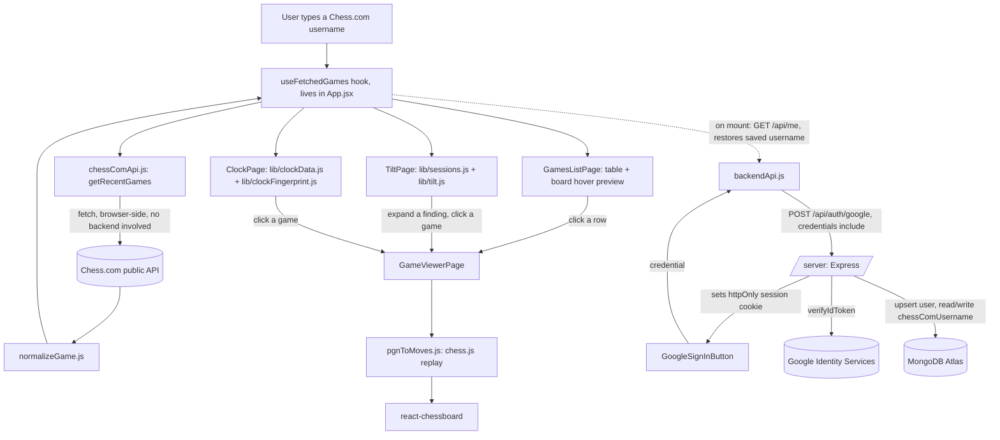

# flow.md — what the app actually does now

This file describes the current state only. It is rewritten each phase, not appended to. See
`decision.md` for the reasoning behind any of this, and `rnd.md` for open questions still being
researched.

## 1. User journey

1. **Games list (`/`)** — a sticky header ("Chess DNA"). Once games are fetched, time-class tabs
   (All / Bullet / Blitz / Rapid / Daily, each with a count) appear right below the header — this
   selection is shared app-wide, not just a table filter (see point 3). Below that, a slim toolbar
   with a Chess.com username field, a slider (3-100, step 10) for how many recent games to fetch,
   and a "Fetch games" button. Beside the toolbar and table sits a chess board: the starting
   position when idle, and the hovered game's final position when hovering a row. The table itself
   is a fixed-height scrolling box (not the whole page growing taller): date, opponent, result,
   time control — showing only games matching the active time-class tab. An unknown username or a
   network problem shows an inline error instead.
2. **Game viewer / analysis board** — clicking any row in the table switches to a board, oriented to
   the user's own colour, with an **evaluation bar** beside it (under it, on a phone) showing who's
   winning and by how much. The bar updates live as you step through the game. You can also **drag
   pieces to play your own moves** from any position — doing so branches into "exploring your own
   line", with the bar following along, and a button to drop back into the real game. The **review
   starts automatically** on opening a game: an engine pass labelling every move — Brilliant, Great,
   Best, Excellent, Good, Inaccuracy, Mistake, Miss, Blunder — in the move list, with the current
   move's verdict spelled out under the board ("Be3 is Good · best was d5"), plus accuracy for both
   players and a rough "≈2236 level this game" strength estimate. Labels appear one at a time as
   they're worked out rather than all at the end, and a game is only ever analysed once — finished
   reviews are saved in the browser, so reopening one shows everything in about a second instead of
   re-analysing for half a minute. Every move also shows its thinking time (e.g.
   "c5 9.7s") when the game has clock data. Opens at the starting position by default — except when opened from a clock
   finding, which jumps straight to the exact position that finding is about. Prev/next/start/end
   buttons and a flip-board button step through the game; clicking any move in the list jumps
   straight to it. A link at the top goes back to the real game on Chess.com. "Back to list" returns
   to whichever screen opened the viewer.
3. **Tilt findings** — appears via the header nav once games are fetched. The same time-class tabs
   from point 1 stay visible and apply here too — switching to "Bullet" re-runs the whole analysis
   on just your bullet games. Shows:
   a one-line "stop after N games" instruction (or "no clear break point yet"), a table of score by
   position-in-session with the break point highlighted, an "after a loss" comparison (overall vs.
   right after any loss vs. right after a loss on time specifically), and a worst-hour-of-day
   finding. Below 20 sessions of 2+ games, shows "not enough games yet" instead of any number.
   Every finding has a "show the N games..." toggle that reveals the real games behind it
   (date/opponent/result), each clickable straight into the board viewer — the evidence rule.
4. **Clock** — appears via the header nav. Shows: opening time share (% of total thinking time
   spent in the first 12 moves), the single longest think found, a count of games lost on time (with
   an evidence list), and a "known position, wasted time" finding — a position reached 20+ times
   (not counting the universal game-start position) where a standout slow think still happened. The
   longest-think and known-position findings both have a "see that position" link that opens the
   viewer sitting on that exact position, not just the start of the game. If none of the fetched
   games have clock data in their PGN, says so plainly instead of showing zeros.

4a. **Blunders** — appears via the header nav. Unlike every other page, this one doesn't compute
   anything until you ask: running Stockfish over a batch of games takes minutes, so it opens with
   a "Scan N games" button and a rough time estimate. During the scan it shows a progress bar
   ("analysing game 7 of 50 — 12 blunders so far") and the tab stays fully usable, because the
   engine runs in a Web Worker rather than on the main thread. When it finishes: a table of every
   moment you threw the game away — move number, what you played, **why it was bad** ("Loses
   material", "Allows mate", "Hangs a piece"), what the engine wanted instead, how much win chance
   it cost, and how long you spent on it. Clicking any row opens that exact move on the board with
   the full reason written out above it ("Qd4 loses your queen on d4 to Bxd4. The engine wanted
   Nf3."), and the move list scrolls itself to that move. Results stay put while you click through
   them — looking at one and coming back doesn't throw the scan away.

The header nav (Games list / Tilt findings / Clock / Blunders) shows buttons for whichever views
you're *not* currently on. No routing library is in use yet — the app is four screens toggled by local state in
`App.jsx`. `react-router` (locked in the tech stack) will be introduced once there are enough
screens that back/forward browser navigation and shareable URLs actually matter.

5. **Onboarding (first screen, first-time visitors only)** — before you've either signed in or
   picked a guest username, you see a dedicated screen: "Sign in with Google" (saves your username
   permanently) or type a Chess.com username and "Continue as guest" (nothing saved, asked again
   next visit). If you're signed in but haven't saved a username yet (fresh account, or a new
   device), it skips straight to just asking for the username, greeting you by name. Once you have a
   saved username, this screen never shows again — you land straight in the app with your games
   already loading.
6. **Signing in later** — the header still shows "Sign in with Google" (if you started as a guest)
   or your name plus "Sign out" (once signed in) even after onboarding. Signing in doesn't gate
   anything — the app works exactly the same as a guest. If you'd already typed a username as a
   guest before signing in, it's carried over to your new account instead of being lost.

## 1a. What's saved, and where

Nothing about your games themselves is saved — only your Chess.com username, tied to your Google
account, in MongoDB Atlas. Every tilt/clock finding is still recomputed fresh from Chess.com on each
visit; nothing about your "DNA" (blind spots, structures, etc. — those come in later phases) exists
yet to be saved.

## 2. Data flow

Games themselves are never persisted — fetched fresh from Chess.com every visit, living only in
React state for that page load. What Mongo stores: one document per signed-in user (email, name,
`chessComUsername`). No engine is involved yet (no evaluation, no move quality) — that starts in
Phase 4.

## 3. File map

| Path | Responsible for |
| --- | --- |
| `/frontend` | React + Vite app, plain JavaScript. All browser-side code lives here. |
| `/frontend/src/main.jsx` | Vite/React entry point. |
| `/frontend/src/App.jsx` + `App.css` | App shell: sticky header, toggles between the games list, viewer, and Tilt page. |
| `/frontend/src/index.css` | Global design tokens (colours, fonts) and base element styles. |
| `/frontend/src/hooks/useFetchedGames.js` | Owns the "fetch from Chess.com" state so the list and Tilt pages share one result set. |
| `/frontend/src/pages/GamesListPage.jsx` + `.css` | Username form, games-to-fetch slider, results table (now a presentational component fed by the hook). |
| `/frontend/src/pages/GameViewerPage.jsx` + `.css` | Board + move list for one game, step controls, flip board. |
| `/frontend/src/pages/TiltPage.jsx` + `.css` | Feature 2: break point, tilt chain, worst hour — each with an evidence toggle. |
| `/frontend/src/components/GameEvidenceList.jsx` + `.css` | Shared clickable game list used to satisfy the evidence rule; reusable by later features. |
| `/frontend/src/lib/chessComApi.js` | Fetches archives/games from the Chess.com public API. |
| `/frontend/src/lib/normalizeGame.js` | Converts a raw Chess.com game into the platform-agnostic internal shape (now includes `resultReason`). |
| `/frontend/src/lib/pgnToMoves.js` | Uses chess.js to turn a PGN into a step-by-step move list with before/after FENs. |
| `/frontend/src/lib/sessions.js` | Groups games into sessions (30-min gap rule), drops single-game sessions. |
| `/frontend/src/lib/tilt.js` | Score-by-session-index, break-point detection, tilt chain, worst hour — all with the underlying games attached for evidence. |
| `/frontend/src/lib/timeClass.js` | Time-class tab counts and filtering — shared by every page via the hook. |
| `/frontend/src/lib/clockData.js` | Extracts per-move thinking time from a PGN's `%clk` comments (plus increment from the TimeControl header). |
| `/frontend/src/lib/clockFingerprint.js` | Opening time share, longest think, games lost on time, known-position wasted time. |
| `/frontend/src/pages/ClockPage.jsx` + `.css` | Feature 3 (partial — see D-020): the four clock findings above, evidence-linked. |
| `/frontend/src/components/TimeClassTabs.jsx` + `.css` | Shared bullet/blitz/rapid/daily filter, rendered once in `App.jsx`, applies to every page. |
| `/frontend/src/components/GoogleSignInButton.jsx` | Wraps Google Identity Services' own button; calls back with the credential to send to `/server`. |
| `/frontend/src/hooks/useAuth.js` | Who's signed in — checks for an existing session on load, exposes `signIn`/`signOut`/`updateChessComUsername`. |
| `/frontend/src/pages/OnboardingPage.jsx` + `.css` | First-time screen: sign in, or type a username and continue as guest; or (if already signed in) just the username step. |
| `/frontend/src/pages/BlundersPage.jsx` + `.css` | Phase 4: the scan button, progress bar, and the resulting table of blunders (each row clickable to that position). |
| `/frontend/src/hooks/useBlunderScan.js` | Runs the scan job: status, progress, results, and cancelling it if you navigate away mid-scan. |
| `/frontend/src/lib/engine.js` | Drives Stockfish in a Web Worker over the UCI text protocol; normalises every score to White's perspective. |
| `/frontend/src/lib/blunderScan.js` | Walks each game's moves, evaluates before/after, and decides what counts as a blunder. |
| `/frontend/src/lib/winPercent.js` | Converts centipawns to win percentage (Lichess's formula) — the measure blunders are actually judged by. |
| `/frontend/src/lib/explainBlunder.js` | Works out *why* a move was bad (lost a piece / allowed mate / hung something) and writes it as a sentence. |
| `/frontend/src/lib/moveLabels.js` | The Brilliant/Great/Book/Best/…/Blunder classification rules, and each label's glyph and colour. |
| `/frontend/src/lib/openingBook.js` | 79 mainstream opening lines — what makes a move "Book". Deliberately small, so it under-fires rather than lying (D-041). |
| `/frontend/src/components/ReviewSummary.jsx` + `.css` | The review scorecard: both players' accuracy, a count of every label each played, and the per-game rating estimate. |
| `/frontend/src/components/PlayerStrip.jsx` + `.css` | One player's row above or below the board — name, rating, and their clock at the move you're looking at. |
| `/frontend/src/components/MoveBadge.jsx` + `.css` | The coloured move-quality medal drawn on the square a piece just moved to. |
| `/frontend/src/lib/reviewGame.js` | Phase 4B's deep review: evaluates every position of one game, labels every move, scores accuracy. |
| `/frontend/src/hooks/useGameReview.js` | Runs that review for the open game — auto-starts, reads/writes the cache, reports partial results. |
| `/frontend/src/lib/reviewCache.js` | Saves finished reviews in the browser (IndexedDB) so a game is only ever analysed once. |
| `/frontend/src/hooks/useLiveEval.js` | Quick depth-12 evaluation of whatever position is on the board, for the bar. |
| `/frontend/src/components/EvalBar.jsx` + `.css` | The vertical (horizontal on mobile) evaluation bar. |
| `/frontend/scripts/copy-stockfish.js` | Postinstall step: copies the engine's `.js`/`.wasm` out of node_modules into `public/stockfish/`. |
| `/frontend/src/lib/backendApi.js` | All calls to `/server` (sign-in, sign-out, `/api/me`, saving the Chess.com username). |
| `/server` | Standalone Express backend (see D-027 — chosen over Vercel functions so it can be hosted independently). Its own `package.json`, run with `npm run dev` inside `/server`. |
| `/server/index.js` | Express app setup, CORS, cookie parsing, route wiring. |
| `/server/db.js` | One shared MongoDB connection for the process's lifetime. |
| `/server/jwt.js` | Signs/verifies our own session token (not Google's) — see D-028. |
| `/server/auth.js` | Verifies a Google credential, upserts the `users` collection, issues the session cookie, `/api/me`, `requireAuth` middleware. |
| `/server/profile.js` | Saves the signed-in user's Chess.com username. |
| `.env.example` / `.env` | Chess.com API base URL, Google Client ID, MongoDB URI, JWT secret, CORS origin, API base URL, server port. |
| `decision.md` | Log of every real decision made on this project, newest first. |
| `flow.md` | This file — current app state, rewritten each phase. |
| `rnd.md` | Open questions and things flagged for the user to research outside this chat. |

## 4. Built / not built

- [x] Phase 0 — Setup: repo skeleton, `/frontend` scaffold, `.gitignore`, `.env.example`,
      `decision.md`, `flow.md`, `rnd.md` created. (The original `/api` placeholder from this phase
      was later removed — see D-027, backend became `/server` instead.)
- [ ] Phase 0 — Deploy to Vercel (paused, see D-005 in `decision.md`)
- [x] Phase 1 — Chess.com: fetch games, list, game viewer with move-by-move playback, design system
- [ ] Phase 1 — Lichess (parked, see D-011 in `decision.md`)
- [x] Phase 2 — Tilt detector (Feature 2): sessions, break point, tilt chain, worst hour, evidence links
- [x] Phase 2 — Clock fingerprint (Feature 3, partial): opening time share, longest think, time
      losses, known-position waste. Engine-dependent parts deferred to Phase 4, see D-020.
- [x] Phase 2 — Time-class filter (bullet/blitz/rapid/daily), shared across every page, see D-019
- [x] Phase 3 — Login and saving: Google sign-in, Express backend, MongoDB, username persistence,
      guest-to-account migration, auto-restore on return visit. Plumbing fully verified by an
      automated test (session cookie + Mongo + auto-fetch); the actual Google OAuth click-through
      needs your real browser (see RQ-001 in `rnd.md`).
- [x] Phase 4 — Stockfish: engine in a Web Worker, blunder detection, progress bar, click through to
      each position. Measured at 3.4s/game (50 games ≈ 165s, inside the doc's 3-minute bar).
      Blunders are judged on win percentage rather than raw centipawns — see D-032.
- [x] Phase 4B — Game review: per-move labels (Brilliant…Blunder), accuracy for both sides,
      evaluation bar, and a playable analysis board. Runs at depth 14/MultiPV 2 rather than the
      doc's 18/3 — measured near-identical output for a fraction of the time, see D-034. Reviews
      auto-start, stream in as computed, and are cached in the browser (26s first time, ~1s after).
- [x] Phase 4B — Matched against Chess.com, on the user's comparison: Great and Brilliant are now
      much harder to earn (D-039), accuracy uses the Lichess curve blended with a harmonic mean
      instead of a too-generous straight line (D-040), and there is a small hand-written opening
      book so early moves read as "Book" (D-041). Reversing D-034's "no Book label".
- [x] Phase 4B — Review scorecard (D-043): both players' accuracy, every label counted for each
      side, and the per-game rating estimate — the Chess.com sidebar, same shape.
- [x] Phase 4B — Both players' clocks beside the board, opponent above and you below, updating as
      you step through the game (D-042).
- [x] Phase 4B — Move quality drawn on the board itself (D-044): a coloured medal on the square the
      piece landed on, both of the move's squares lit, and a green arrow showing the better move
      when there was one.
- [ ] Phase 5 — Tagging and baseline
- [ ] Phase 6 — Repetition queue
- [ ] Phase 7 — Opening fit
- [ ] Phase 8 — Shadow self
