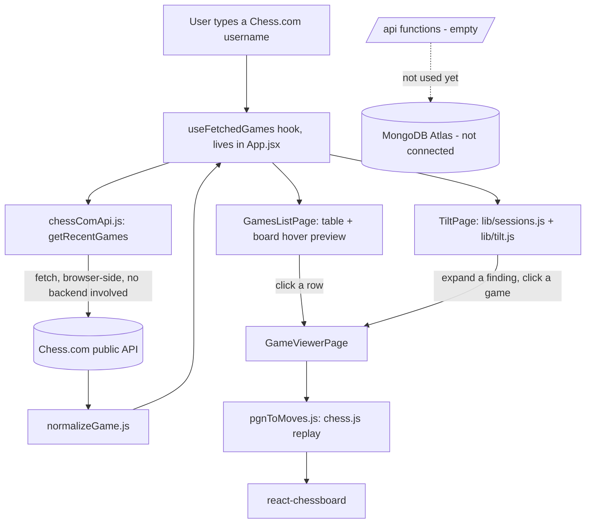

# flow.md — what the app actually does now

This file describes the current state only. It is rewritten each phase, not appended to. See
`decision.md` for the reasoning behind any of this, and `rnd.md` for open questions still being
researched.

## 1. User journey

1. **Games list (`/`)** — a sticky header ("Chess DNA"), a slim toolbar with a Chess.com username
   field, a slider (10-100, step 10) for how many recent games to fetch, and a "Fetch games" button.
   Beside the toolbar and table sits a chess board: the starting position when idle, and the
   hovered game's final position when hovering a row (a quick visual read of how that game ended).
   On submit, a dense table appears: date, opponent, result, time control. An unknown username or a
   network problem shows an inline error instead of the table.
2. **Game viewer** — clicking any row in the table switches to a board (starting position by
   default, oriented to the user's own colour) beside a move list. Prev/next/start/end buttons and
   a flip-board button step through the game; clicking any move in the list jumps straight to it. A
   link at the top goes back to the real game on Chess.com. "Back to list" returns to whichever
   screen opened the viewer (the games list or the Tilt page).
3. **Tilt findings** — a "Tilt findings" link appears in the header once games are fetched. Shows:
   a one-line "stop after N games" instruction (or "no clear break point yet"), a table of score by
   position-in-session with the break point highlighted, an "after a loss" comparison (overall vs.
   right after any loss vs. right after a loss on time specifically), and a worst-hour-of-day
   finding. Below 20 sessions of 2+ games, shows "not enough games yet" instead of any number.
   Every finding has a "show the N games..." toggle that reveals the real games behind it
   (date/opponent/result), each clickable straight into the board viewer — the evidence rule.

No routing library is in use yet — the app is three screens toggled by local state in `App.jsx`.
`react-router` (locked in the tech stack) will be introduced once there are enough screens that
back/forward browser navigation and shareable URLs actually matter.

## 2. Data flow

Nothing is persisted anywhere yet — games live only in React state for the current page load.
`/api` has no functions in it. No database connection exists. No engine is involved (no evaluation,
no move quality).

## 3. File map

| Path | Responsible for |
| --- | --- |
| `/frontend` | React + Vite app, plain JavaScript. All browser-side code lives here. |
| `/frontend/src/main.jsx` | Vite/React entry point. |
| `/frontend/src/App.jsx` + `App.css` | App shell: sticky header, toggles between the games list, viewer, and Tilt page. |
| `/frontend/src/index.css` | Global design tokens (colours, fonts) and base element styles. |
| `/frontend/src/hooks/useFetchedGames.js` | Owns the "fetch from Chess.com" state so the list and Tilt pages share one result set. |
| `/frontend/src/pages/GamesListPage.jsx` + `.css` | Username form, games-to-fetch slider, results table (now a presentational component fed by the hook). |
| `/frontend/src/pages/GameViewerPage.jsx` + `.css` | Board + move list for one game, step controls, flip board. |
| `/frontend/src/pages/TiltPage.jsx` + `.css` | Feature 2: break point, tilt chain, worst hour — each with an evidence toggle. |
| `/frontend/src/components/GameEvidenceList.jsx` + `.css` | Shared clickable game list used to satisfy the evidence rule; reusable by later features. |
| `/frontend/src/lib/chessComApi.js` | Fetches archives/games from the Chess.com public API. |
| `/frontend/src/lib/normalizeGame.js` | Converts a raw Chess.com game into the platform-agnostic internal shape (now includes `resultReason`). |
| `/frontend/src/lib/pgnToMoves.js` | Uses chess.js to turn a PGN into a step-by-step move list with before/after FENs. |
| `/frontend/src/lib/sessions.js` | Groups games into sessions (30-min gap rule), drops single-game sessions. |
| `/frontend/src/lib/tilt.js` | Score-by-session-index, break-point detection, tilt chain, worst hour — all with the underlying games attached for evidence. |
| `/api` | Serverless functions (Vercel convention). Empty — untouched until Phase 3. |
| `.env.example` / `.env` | `VITE_CHESSCOM_API_BASE_URL` today; more added only when the code reading them exists. |
| `decision.md` | Log of every real decision made on this project, newest first. |
| `flow.md` | This file — current app state, rewritten each phase. |
| `rnd.md` | Open questions and things flagged for the user to research outside this chat. |

## 4. Built / not built

- [x] Phase 0 — Setup: repo skeleton, `/frontend` scaffold, `/api` placeholder, `.gitignore`,
      `.env.example`, `decision.md`, `flow.md`, `rnd.md` created.
- [ ] Phase 0 — Deploy to Vercel (paused, see D-005 in `decision.md`)
- [x] Phase 1 — Chess.com: fetch games, list, game viewer with move-by-move playback, design system
- [ ] Phase 1 — Lichess (parked, see D-011 in `decision.md`)
- [x] Phase 2 — Tilt detector (Feature 2): sessions, break point, tilt chain, worst hour, evidence links
- [ ] Phase 2 — Clock fingerprint (Feature 3): not started
- [ ] Phase 3 — Login and saving
- [ ] Phase 4 — Stockfish (blunder detection)
- [ ] Phase 4B — Game review (move labels, accuracy)
- [ ] Phase 5 — Tagging and baseline
- [ ] Phase 6 — Repetition queue
- [ ] Phase 7 — Opening fit
- [ ] Phase 8 — Shadow self
