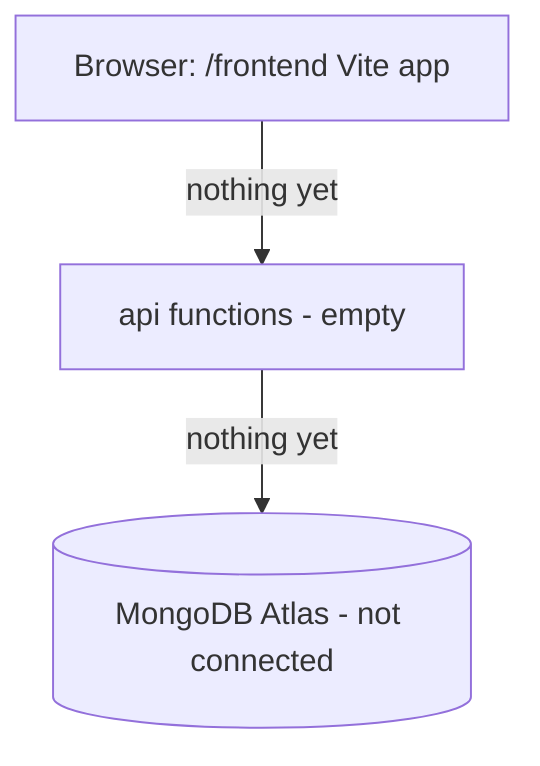

# flow.md — what the app actually does now

This file describes the current state only. It is rewritten each phase, not appended to. See
`decision.md` for the reasoning behind any of this, and `rnd.md` for open questions still being
researched.

## 1. User journey

There is no user-facing behaviour yet. Opening the app in a browser shows the default Vite + React
starter page (logo, counter button) — nothing built for this project yet.

## 2. Data flow

No data moves anywhere yet. `/api` has no functions in it. No database connection exists.

## 3. File map

| Path | Responsible for |
| --- | --- |
| `/frontend` | React + Vite app, plain JavaScript. All browser-side code lives here. |
| `/frontend/src/main.jsx` | Vite/React entry point (default scaffold, not yet edited). |
| `/frontend/src/App.jsx` | Default scaffold component (default scaffold, not yet edited). |
| `/frontend/src/pages` | One file per screen/route. Empty until Phase 1. |
| `/frontend/src/components` | Reusable UI pieces (board, lists, cards). Empty until Phase 1. |
| `/frontend/src/lib` | Non-UI logic: chess.js helpers, Chess.com/Lichess API clients, DNA shape helpers. Empty until Phase 1. |
| `/frontend/src/hooks` | Shared React hooks. Empty until needed. |
| `/api` | Serverless functions (Vercel convention). Empty — untouched until Phase 3. |
| `.env.example` | Documents required environment variables. Currently empty — no secrets needed yet. |
| `decision.md` | Log of every real decision made on this project, newest first. |
| `flow.md` | This file — current app state, rewritten each phase. |
| `rnd.md` | Open questions and things flagged for the user to research outside this chat. |

## 4. Built / not built

- [x] Phase 0 — Setup: repo skeleton, `/frontend` scaffold, `/api` placeholder, `.gitignore`,
      `.env.example`, `decision.md`, `flow.md`, `rnd.md` created.
- [ ] Phase 0 — Deploy to Vercel (paused, see D-005 in `decision.md`)
- [ ] Phase 1 — Fetch games (Chess.com + Lichess, game viewer)
- [ ] Phase 2 — Tilt + Clock
- [ ] Phase 3 — Login and saving
- [ ] Phase 4 — Stockfish (blunder detection)
- [ ] Phase 4B — Game review (move labels, accuracy)
- [ ] Phase 5 — Tagging and baseline
- [ ] Phase 6 — Repetition queue
- [ ] Phase 7 — Opening fit
- [ ] Phase 8 — Shadow self
